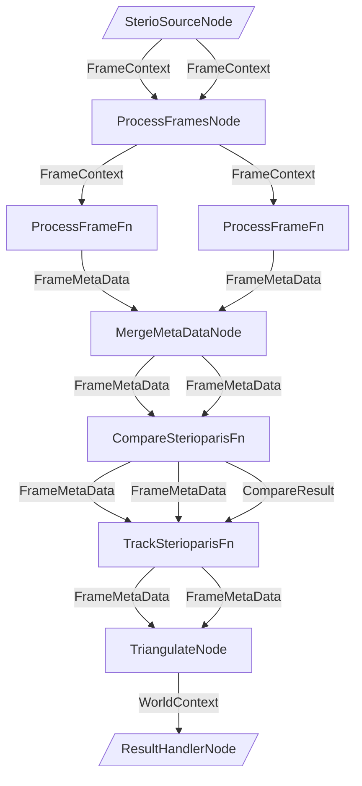

```mermaid 
flowchart TD     
  SRCN[/SterioSourceNode/] -- FrameContext --> PFN[ProcessFramesNode]     
  SRCN -- FrameContext --> PFN     
  PFN -- FrameContext --> PF1[ProcessFrameFn]     
  PFN -- FrameContext --> PF2[ProcessFrameFn]     
  PF1 -- FrameMetaData --> MMN[MergeMetaDataNode]     
  PF2 -- FrameMetaData --> MMN     
  MMN -- FrameMetaData --> CompareSterioparisFn -- FrameMetaData --> TrackSterioparisFn -- FrameMetaData --> TN[TriangulateNode]     
  MMN -- FrameMetaData --> CompareSterioparisFn -- FrameMetaData --> TrackSterioparisFn -- FrameMetaData --> TN[TriangulateNode]     
  CompareSterioparisFn -- CompareResult --> TrackSterioparisFn     
  TN -- WorldContext --> RHN[/ResultHandlerNode/] 
```

